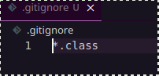
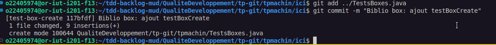
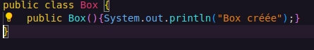
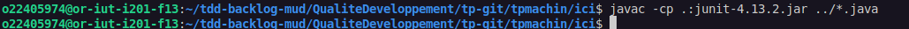
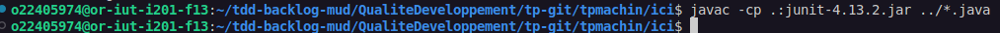

## Qualité Développement Matéo Gezault Rendu TP#3

### Question 1)

Effectivement, le fichier TestsBoxes ne compilent pas, tout simplement parce que nous tentons de créer un élement de type Box, sauf que nous n'avons pas créer de class Box.

### Question 3 ) 

J'ai créé mon git ignore, j'y ai entré *.class pour dire que je voulais ignorer tous les fichiers terminant par .class.
Ensuite je l'ai commit dans une branche séparée.

### Question 4 ) 

### Question 5 )

### Question 6 )

### Question 8 )

