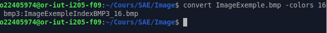
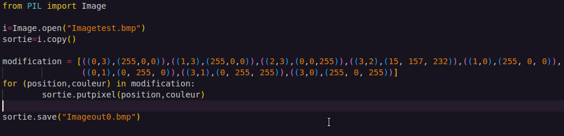

# Rendu de la SAE Image par Matéo Gezault

  

# Partie A

## A.0)

Voici le message d'erreur renvoyé par le terminal: 
display-im6.q16: length and filesize do not match `ImageExemple.bmp' @ error/bmp.c/ReadBMPImage/958.

La raison de l'erreur est toute bête, en effet, dans le fichier, il y a 3 octets dédiés à la mémoire dans le fichier qui permettent de noter le poids du fichier, ces trois octets dans le fichier indiquent la valeur "OC7399" 

soit 816 025 octets, sauf que le poids réel du fichier est 816 026 (on peut le savoir grâce aux propriétés du fichier). Il y a donc une incohérence qu'il faut régler, pour ceci, rien de plus simple, il suffit de modifier la valeur des octets dans Okteta et d'y écrire "OC739A".
Comme c'est en little endian, il faut modifier le premier octet et y inscrire 9A à la place de 99. 

## A.1)

Pour cette question, il fallait principalement suivre les instructions données pour créer le fichier et réaliser l'entête et le BITMAPCOREHEADER.

Puis par la suite, il fallait remplir les octets afin de colorier les pixels pour avoir les couleurs demandés, c'est à dire un damier de couleur entre blanc et rouge. Le plus dur lors de cette question était de ne pas s'emmêler les pinceaux dans les insertions de valeurs, en effet, j'ai au début mal compris où était mon erreur et je me suis retrouvé avec des couleurs qui n'avait aucun rapport avec celles que je voulais. J'ai finalement réussi à avoir les couleurs désirées.

## A.2) 

Cette question-ci était plus simple que la précédente, en effet, il ne fallait que modifier les valeurs de pixels. La difficulté de la question était de ne pas oublier d'inverser les valeurs en particulier pour le bleu céruléen.

## A.3)

### A.3.1)

Il y a 24 bits par pixel, on peut l'affirmer grâce aux deux octets entourés en rouge qui permettent de transmettre la quantité de bits par pixel. Il y est inscrit "18 00" comme c'est en little endian on inverse les valeurs, et 18 (base 16) en décimal vaut 24. 

### A.3.2)

Comme on peut le voir sur l'image, il y a 4x4 pixels sur l'image, soit 16 pixels.
Pour obtenir ces informations, j'ai fait un clic droit sur l'image, propriété, image.

On peut aussi le voir grâce à ces octets entourés, qui représente en premier la largeur puis la hauteur, les deux valeurs sont à 04 00 00 00, encore une fois, nous sommes en little endian donc nous inversons et obtenons 4x4, alors il y a 4 pixels sur 4 pixels.

### A.3.3)

En regardant dans les propriétés de l'image, on sait que l'image faisait 74 octets avant la conversion, mais qu'après conversion, on voit que l'image en fait désormais 102, donc il n'y a pas de compression utilisée, au contraire, sa taille augmente.

On peut confirmer ce que dise l'onglet propriété en allant dans Okteta et cherchons la taille inscrite dans le fichier, c'est inscrit 66 00 en little endian, si on convertit en décimal, on obtient bien 102 octets, donc la taille du fichier à bien augmenter.

### A.3.4)

Sachant qu'avant la conversion, chaque pixel était codé sur 24 bits et qu'après conversion, chaque pixel est codé sur 48 bits, alors le format de codage de bits a effectivement changé.

## A.4.1)

Il y a 8 bits par pixel. Sur l'image, il y a 2 octets entourés en rouge, il y a écrit 01 00, comme c'est en little endian on inverse les octets, et nous obtenons la valeur 00 01, soit 1 en décimal, cela signifie donc qu'il y a 1 bit par pixel.

## A.4.2)

Comme on peut le voir sur l'image, il y a 4x4 pixels sur l'image, soit 16 pixels.
Pour obtenir ces informations, j'ai fais un clic droit sur l'image, propriété, image.

On peut aussi le voir grâce à ces octets entourés, qui représente en premier la largeur puis la hauteur, les deux valeurs sont à 04 00 00 00, encore une fois, nous sommes en little endian donc nous inversons et obtenons 4x4, alors il y a 4 pixels sur 4 pixels.

### A.4.3)

En regardant dans les propriétés de l'image, on sait que l'image faisait 102 octets avant la conversion, mais qu'après conversion, on voit que l'image en fait désormais 78, donc il y a bien eu une compression car sa taille a diminué et demande maintenant moins de bits pour être stocké.

On peut confirmer ce que dise l'onglet propriété en allant dans Okteta et cherchons la taille inscrite dans le fichier, c'est inscrit 4E 00 en little endian, si on convertit en décimal, on obtient bien 78 octets, donc la taille du fichier à bien diminuer.

### A.4.4)

Les couleurs sont codées sur 6 octets, 3 octets par couleur, ceux ci sont définis dans l'entête. 

### A.4.5)

Il y a deux couleurs dans la palette, on peut lire cette information à l'adresse 2E du fichier bmp sur Okteta.

### A.4.6)

A la base, chaque pixel est codé sur 24 bits, or, dans cette version ce l'image, chaque pixel est codé sur 1 bit, dans ce cas, effectivement, le codage des pixels a changé. Ceci est tout à fait logique, puisque nous avons passé notre image en mode index de couleurs.

### A.4.7)

Afin de changer la couleur du rouge et de le transformer en bleu, j'ai dû modifier la palette, qui était auparavant avec la valeur __00 00 FF 00__ FF FF FF 00 qui indiquait la couleur rouge et la couleur blanche. Que j'ai modifier en __FF 00 00 00__ FF FF FF 00 qui indique désormais la couleur bleue et la couleur blanche.

### A.4.8)

Afin d'inverser le damiers pour que le bleu soit à la place du blanc et que le blanc soit à la place du bleu, rien de plus simple, il suffit d'inverser les deux couleurs de la palette. C'est à dire qu'au lieu d'avoir l'ordre suivant :  FF 00 00 00 FF FF FF 00. On inscrit cet ordre ci :  FF FF FF 00 FF 00 00 00.

### A.4.9)

Afin d'obtenir le résultat voulu, il faut reprendre l'image 2.
Ensuite, afin d'obtenir le résultat désiré, il me faut modifier les valeurs de pixels. 
Les pixels de ligne me permettent de modifier la couleur de toute la ligne en modifiant uniquement leur valeur. IL y a un pixel de ligne tous les 4 octets
Il y a des valeurs qui me permettent d'obtenir des résultats différents, par exemple, remplacer un des pixel de ligne par 00 me permet d'avoir une ligne toute rouge et la valeur FF me permet d'avoir une ligne toute blanche. La valeur 50 me permet d'avoir le motif "Rouge, Blanc, Rouge, Blanc" et la valeur A0 me permet d'avoir l'inverse, c'est à dire "Blanc, Rouge, Blanc,Rouge".

Alors, j'ai simplement besoin de modifier la valeur des pixels de ligne avec la valeur correspondante et dans le bon ordre (on commence par la ligne du bas) et ainsi, il est simple d'obtenir le résultat désiré.

### A.4.10)

### A.4.11)

Il y a 16 couleurs dans l'image, on peut le lire aux adresses 2E et 2F. En effet, l'information est encodée sur 16 bits en little endian, ainsi, 00 10, ce qui signifit 16 couleurs.

### A.4.12)

On peut trouver la couleur dominante à l'adresse 66 jusqu'à l'adresse 6A, avec pour valeur FE FE FD 00, en effet, le blanc à souvent des composants coloriques élevés, ainsi les composantes de la couleur décrite à l'adresse 66 
est la couleur la plus proche du blanc trouvée dans la palette.

### A.4.13)

On peut trouver l'adresse de début du tableau de pixel à l'adresse 0A du fichier, celui ci indique l'adresse 76.

### A.4.14)

Chaque pixel est codé sur 4 bits, ainsi chaque caractère sur Okteta (à partir de l'adresse 76 représente un pixel). 
Ainsi, si je veux modifier la couleur et faire apparaitre une ligne de pixels bleus, je dois modifier les premiers octets du tableau de pixel avec une couleur tendant vers le bleu dans la palette, en l'occurence, j'ai utilisé la 8e.

### A.4.15)

Lorsque l'on diminue le nombre de couleur dans la palette, il y a différentes conséquences.
Par exemple, au niveau visuel, il y a moins de contraste entre les couleurs et les mêmes couleurs sont moins fréquentes limitant donc les possibilités de dégradés de couleurs. En l'occurence, pour l'image d'exemple, il y a une sphère de gris autour du globe principale, sauf que dans cette sphère, il y a plusieurs nuances de gris, donc si l'on diminue la palette, cela mène à ce que la sphère soit presque supprimée et presque entièrement remplacée par la couleur la plus proche d'un point de vue hexadécimal et donc mener à des incohérences graphiques, pour cet exemple, il ne reste plus qu'un cercle de point détachés.

D'un point de vue hexadécimal, si l'on supprime simplement les couleurs de la palette sans modifier les valeurs dans le tableau de pixel, cela va mener à (comme dit précédemment) ce que toutes les couleurs introuvables dans la palette soit redirigée vers la couleur la plus proche.
Réduire la taille de la palette peut permettre de réduire la taille du fichier.

## A.5) 

### A.5.2)

Il est impossible d'entrer -4 comme tel, il faut donc traduire 4 en C2 et le retraduire en hexadécimal, ainsi, on obtient FF FF FF FC. Nous n'avons plus qu'à l'entrer dans Okteta à l'adresse 16 en respectant l'endianess (little endian) et voir le résultat.

Le résultat est intriguant, mais après réflexion, c'est relativement simple de comprendre ce qu'il s'est passé, en effet, l'image est inversée. 
L'utilisation de valeurs négatives dans la hauteur d'Okteta permet de lire les lignes à l'envers et ainsi produire cet effet de renversement.

### A.5.3)

Afin de renverser l'image, j'ai récupéré la hauteur de l'image : 01A9 soit 425.
Puis j'ai utilisé le même principe qu'à la question précédent afin de le traduire en valeur négative en hexadécimale.
Ainsi, j'ai obtenu FF FF FE 57, ensuite j'ai entré ceci dans Okteta en respectant l'endianess et j'ai pu renverser l'image comme demandé.

## A.6)

### A.6.1)

En regardant les 4 octets à partir de l'adresse 02, on voit écrit 04 60 00 00, si l'on lit la valeur décimale (en little endian), on trouve 1120 octets. Si la taille du fichier a autant augmenté c'est sûrement à cause du nombre d'octets qui a drastiquement augmenté.

### A.6.2)

D'après l'offset dans l'entête, l'adresse de début des pixels est à l'adresse 0436.

### A.6.3)

Il y a 8 bits par pixels, soit 1 octet par pixel.

L'image a une taille de 4 pixels sur 4 pixels. On peut lire la largeur de l'image à l'indice 12 sur 4 octets et on peut lire la hauteur de l'image à l'indice 16 sur 4 octets.

Avant conversion, l'image faisait 102 octets, maintenant, elle en fait 1120, ainsi, il n'y a pas eu compression, au contraire.

En ce qui concerne la palette, il n'y a toujours que deux couleurs, une indiquant la couleur rouge et l'autre indiquant la couleur blanche.

Evidemment, la méthode de codage de pixel a changée entre l'image1 et l'image4, en effet, l'image1 code 1 pixel en 3 octets, alors que l'image4 code 1 pixel en 1 octet.

## A.7)

### A.7.1)

Le poids de l'image 5 est de 044E octets en hexadécimal, soit 1102 octets en décimal.

Si le fichier a perdu du poids, c'est parce que la compression RLE est particulièrement adaptée à ce fichier qui a des successions de 01 par moment et la compression RLE permet d'économiser quelques octets (18 en l'occurence).

## A.7.2)

Il y a 8 bits par pixels, soit 1 octet par pixel.

L'image a une taille de 4 pixels sur 4 pixels. On peut lire la largeur de l'image à l'indice 12 sur 4 octets et on peut lire la hauteur de l'image à l'indice 16 sur 4 octets.

Avant conversion, l'image faisait 78 octets, maintenant, elle en fait 1102, ainsi, il n'y a pas eu compression, au contraire.

En ce qui concerne la palette, il n'y a toujours que deux couleurs, une indiquant la couleur rouge et l'autre indiquant la couleur blanche.

Evidemment, la méthode de codage de pixel a changée entre l'image3 et l'image5, en effet, l'image3 code 1 pixel en 1 bit, alors que l'image5 code 1 pixel en 1 octet.

### A.8)

Afin de recréer le code nécessaire, j'ai eu besoin de comprendre comment coder des pixels avec la compression RLE.
En réalité, c'était moins dur que prévue, il suffit d'écrire en premier lieu le nombre de répétitions et ensuite la couleur désirée, en l'ocurrence, 01 pour le blanc et 00 pour le rouge.

### A.9)

Afin de pouvoir reproduire le motif demandé, il m'a fallu rajouté les couleurs voulues dans la palette afin d'avoir du bleu et du vert. Pour ça, rien de plus simple, j'ai eu besoin d'ajouter les bonnes valeurs à la suite de la couleur blanche dans la palette en respectant le BGRA.

Palette : 

### A.10)

Pour cette question, je devais utiliser la même palette et je devais juste montrer que j'avais bien compris le fonctionnement et ainsi, j'ai facilement pu reproduire le coloriage désiré.

Mais étrangement, sur cette question, il me manquait deux octets afin de pouvoir colorier le dernier pixel, alors j'ai rajouté 2 à la valeur contenur à l'adresse 0A

# Partie B

Dans cette section, vous trouverez les codes Python dans les répertoires nommés B# (# représentant le numéro de la question).

## B.1)

Afin d'obtenir le résultat désiré, j'ai fais une liste de tuple contenant la position de la modification puis la couleur après modification.
Au début, j'ai eu un peu de mal à comprendre les coordonnées, vue que c'est l'inverse d'Okteta, ici les coordonnées 0,0 correspondent au pixel en haut à gauche alors que sur Okteta, on commence par le bas. Mais une fois que j'ai compris comment marchaient les coordonnées, c'était relativement simple.

## B.2)

Dans l'objectif d'inverser l'image de gauche à droite, j'ai du aller me renseigner sur le site du module pillow pour trouver la méthode appropriée. Ainsi, j'ai finis par trouver la méthode transpose avec l'attribut FLIP_LEFT_RIGHT qui m'a permit de faire la modification désirée plutôt simplement et de m'éviter une bloque très longue double boucle.

## B.3)

Au début du code, j'ai créé une nouvelle image en la mettant en mode niveau de gris (L) avec les dimensions du logo de l'IUT.
Cette fois ci, afin de d'effectuer la modification demandée, j'ai dû faire une double boucle en passant la valeur colorée de chaque pixel en valeur de gris que j'ai stockée dans une liste.
Puis ensuite, j'ai entré ma liste des niveaux de gris dans la méthode putdata() avec ma nouvelle image, ce qui m'a permit d'obtenir le logo de l'IUT avec uniquement des teintes de gris.

## B.4)

Afin de traduire l'image en noir et blanc, j'ai un peu recopié la méthode de la question précédente, c'est à dire en créant une nouvelle image avec les mêmes dimensions que le logo. 

Mais en rajoutant une conditionelle dans ma boucle, si la valeur de rouge au carré plus la valeur de vert au carré plus la valeur de rouge au carré est supérieure ou égale à 255 * 255 * 2 / 3, alors j'ajoute un 255 (pixel blanc) dans ma liste et sinon j'ajoute un 0 (pixel noir) dans ma liste.
Puis j'ai encore une fois ma liste en paramètre dans la méthode putdata() dans la nouvelle image. 
Ce qui m'a donné l'image en noir et blanc.

  
  

## B.5)

Pour cette dernière question, j'ai fais deux fichiers python, un servant à coder les bits rouges, c'est à dire que j'ai copié l'image montrant la devanture et du département puis à mettre toutes les valeurs rouges à une valeur paire, puis j'ai ajouté 1 si le pixel du logo aux coordonnées correspondantes était blanc. Et s'il était noir, j'ai laissé la valeur rouge à une valeur paire.

Et sur le second fichier, j'ai fais un code permettant de décoder le message, c'est à dire à détecter si la valeur rouge était paire ou impaire. Si elle est paire, alors il transforme le pixel en un pixel noir et si au contraire, la valeur est impaire, alors il transforme le pixel en pixel blanc.
Ce qui me permet de faire apparaitre le logo de l'IUT et montrer que mon cryptage et mon décryptage marchent bel et bien.
Voici mes résultats finaux : 

On peut voir qu'en bas de l'image, il se passe quelque chose de bizarre, en effet, vue que j'ai utilisé les dimensions du logo afin de coder le logo et qu'il est plus petit que l'image originale, tous les pixels n'ont pas été cryptés. Si nous avions utilisé les dimensions de l'image originale, nous aurions eu une erreur puisque les coordonnées de l'image auraient finis par dépasser les dimensions du logo et ainsi demander des coordonnées trop grande et ainsi produire une IndexError. 
C'est à dire que les pixels du bas n'étaient pas toucher par le cryptage et étaient paires ou impairs indépendamment de ma volonté. Et donc lors du décryptage, j'ai décrypté l'entièreté de l'image et donc ces mêmes pixels qui n'ont pas été crypté.

## Partie Bonus :

### B.7)

Un chiffrement est considéré comme incassable lorsqu'il est presque impossible de brute-force, c'est à dire lorsque sa prendrais  trop de temps à découvrir la clé si on la cherchait à la "main" (ou même avec un bot).
Et avec le chiffre de Vernam permet de proposer un système de cryptage différents pour chacun des caractères, c'est à dire que même si on a deux fois la même lettre dans le message, on ne peut pas être sûr que la clé soit la même pour ces deux mêmes caractères.
Ainsi, il est impossible de décrypter un message codé à l'aide du chiffre de Vernam car même si l'on calculer les 26 possibilités pour chacun des caractères, il serait impossible de tenter de reconstruire le résultat puisque ca reviendrait à assembler des lettres au hasard. Puisque calculer les 26 possibilités revient juste à réécrire l'alphabet.

Mais les seules conditions qui permettent au chiffre de Vernman d'être incassable est que la clé soit réellement aléatoire et non connue par un tiers qui pourrait la dévoiler.
En effet, à partir du moment où nous connaissons la clé, le décryptage devient tout de suite très facile et le chiffremenet n'est plus du tout incassable.
Et de même, si la clé n'est pas aléatoire, alors il reste certes très compliqué de calculer la clé, mais c'est possible en tentant de deviner la suite de caractères.

Tentons de coder un message avec le chiffre de Vernam :

Message : 
quellebellejournee

Clef :
Leagueoflegendsestunsuperjeuvraimentsuper
(Ceci est un mauvais exemple de clé puisqu'elle n'est absolument pas aléatoire.)

Résultat : 

16+11  = b
20+4 = y
4+0 = e
11+6  =r
11+20 = f
4+4 = i
1+14  = p
4+5 = j
11+11 =w
11+4 = p
4+6 =k
9+4 =n
14+13 = b
20+3 =  =x
17+18 = j
13+4 = r
4+18 = w
4+19 = x

byerfipjwpknbxjrwx