# Rendu de la SAE Image par Matéo Gezault

## A.0)

Voici le message d'erreur renvoyé par le terminal: 
display-im6.q16: length and filesize do not match `ImageExemple.bmp' @ error/bmp.c/ReadBMPImage/958.

La raison de l'erreur est toute bête, en effet, dans le fichier, il y a 3 octets dédiés à la mémoire dans le fichier qui permettent de noter le poids du fichier, ces trois octets dans le fichier indiquent la valeur "OC7399" 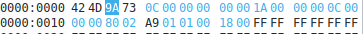soit 816 025 octets, sauf que le poids réel du fichier est 816 026 (on peut le savoir grâce aux propriétés du fichier). Il y a donc une incohérence qu'il faut régler, pour ceci, rien de plus simple, il suffit de modifier la valeur des octets dans Okteta et d'y écrire "OC739A".
Comme c'est en little endian, il faut modifier le premier octet et y inscrire 9A à la place de 99. 

## A.1)

Pour cette question, il fallait principalement suivre les instructions données pour créer le fichier et réaliser l'entête et le BITMAPCOREHEADER.

Puis par la suite, il fallait remplir les octets afin de colorier les pixels pour avoir les couleurs demandés, c'esst à dire un damier de couleur entre blanc et rouge. Le plus dur lors de cette question était de ne pas s'emmêler les pinceaux dans les insertions de valeurs, en effet, j'ai au début mal compris où était mon erreur et je me suis retrouvé avec des couleurs qui n'avait aucun rapport avec celles que je voulais. J'ai finalement réussis à avoir les couleurs désirées.

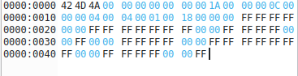

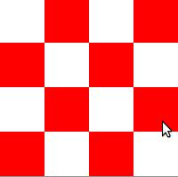

## A.2) 

Cette question-ci était plus simple que la précédente, en effet, il ne fallait que modifier les valeurs de pixels. La difficulté de la question était de ne pas oublier d'inverser les valeurs en particulier pour le bleu céruléen.
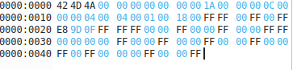

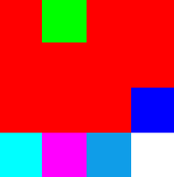

## A.3)

### A.3.1)

Il y a 48 bits par pixel, on peut l'affirmer grâce aux deux octets entourés en rouge qui permettent de transmettre la quantité de bits par pixel. Il y est inscrit "30 00" comme c'est en little endian on inverse les valeurs, et 30 (base 16) en décimal vaut 48. 

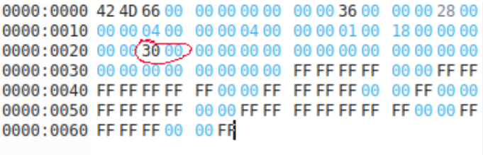

### A.3.2)

Comme on peut le voir sur l'image, il y a 4x4 pixels sur l'image, soit 16 pixels.
Pour obtenir ces informations, j'ai fais un clique droit sur l'image, propriété, image.

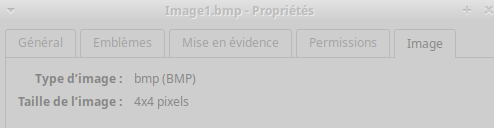

On peut aussi le voir grâce à ces octets entourés, qui représente en premier la largeur puis la hauteur, les deux valeurs sont à 04 00 00 00, encore une fois, nous sommes en little endian donc nous inversons et obtenons 4x4, alors il y a 4 pixels sur 4 pixels.

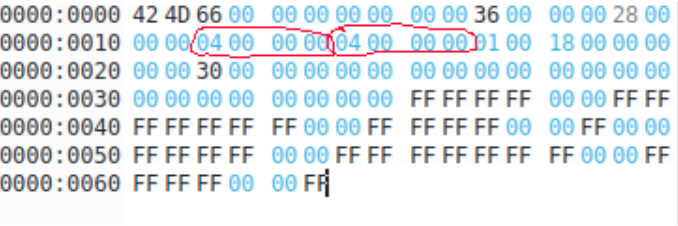

### A.3.3)

En regardant dans les propriétés de l'image, on sait que l'image faisait 74 octets avant la conversion, mais qu'après conversion, on voit que l'image en fait désormais 102, donc il n'y a pas de compression utilisée, au contraire, sa taille augmente.

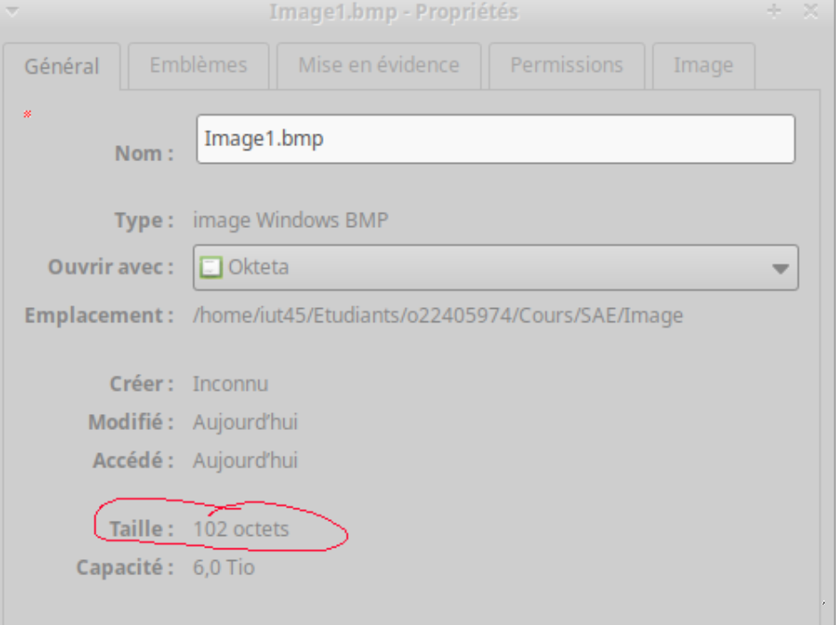

On peut confirmer ce que dise l'onglet propriété en allant dans Okteta et cherchons la taille inscrite dans le fichier, c'est inscrit 66 00 en little endian, si on convertit en décimal, on obtient bien 102 octets, donc la taille du fichier à bien augmenter.

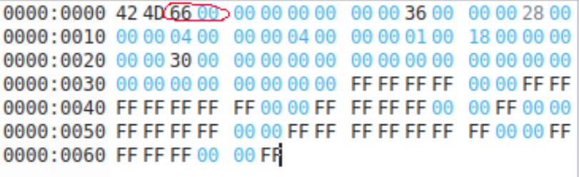

### A.3.4)

Sachant qu'avant la conversion, chaque pixel était codé sur 24 bits et qu'après conversion, chaque pixel est codé sur 48 bits, alors le format de codage de bits a effectivement changé.

## A.4.1)

Il y a 8 bits par pixel. Sur l'image, il y a 2 octets entourés en rouge, il y a écrit 01 00, comme c'est en little endian on inverse les octets, et nous obtenons la valeur 00 01, soit 1 en décimal, cela signifit donc qu'il y a 1 bit par pixel.

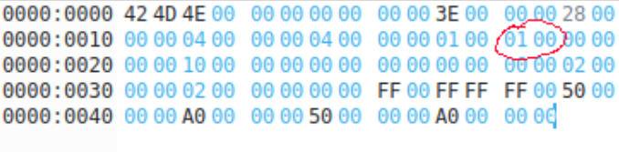

## A.4.2)

Comme on peut le voir sur l'image, il y a 4x4 pixels sur l'image, soit 16 pixels.
Pour obtenir ces informations, j'ai fais un clique droit sur l'image, propriété, image.

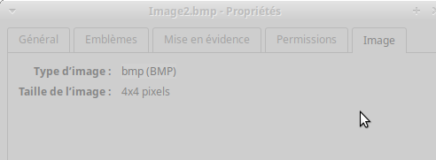

On peut aussi le voir grâce à ces octets entourés, qui représente en premier la largeur puis la hauteur, les deux valeurs sont à 04 00 00 00, encore une fois, nous sommes en little endian donc nous inversons et obtenons 4x4, alors il y a 4 pixels sur 4 pixels.

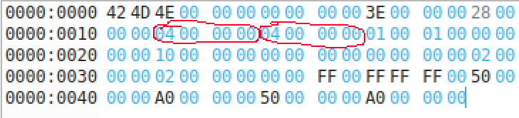

### A.4.3)

En regardant dans les propriétés de l'image, on sait que l'image faisait 102 octets avant la conversion, mais qu'après conversion, on voit que l'image en fait désormais 78, donc il y a bien eu une compression car sa taille a diminué et demande maintenant moins de bits pour être stocké.

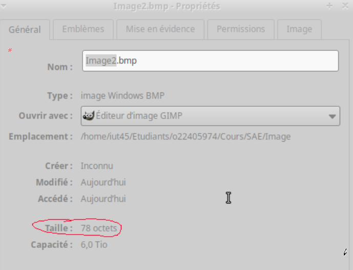

On peut confirmer ce que dise l'onglet propriété en allant dans Okteta et cherchons la taille inscrite dans le fichier, c'est inscrit 4E 00 en little endian, si on convertit en décimal, on obtient bien 78 octets, donc la taille du fichier à bien diminuer.

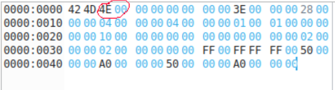

### A.4.4)